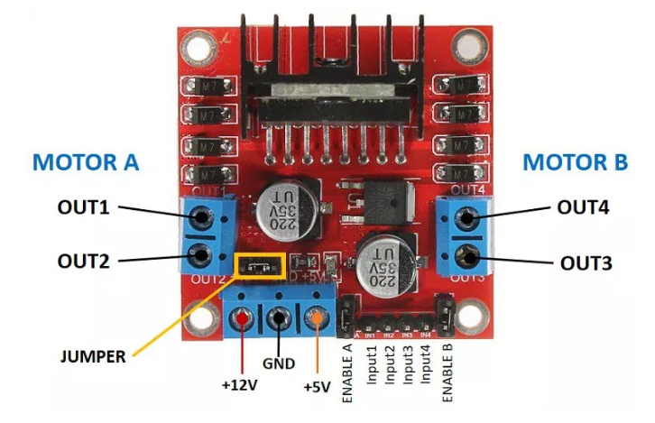
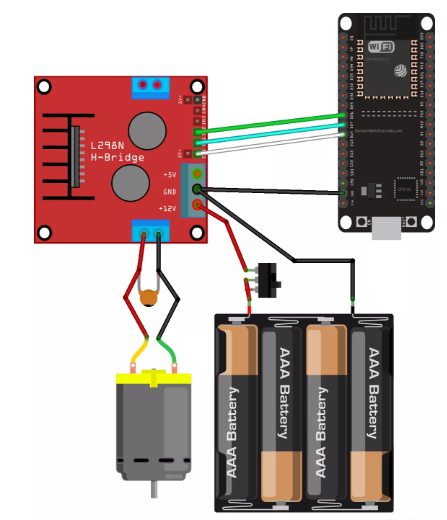
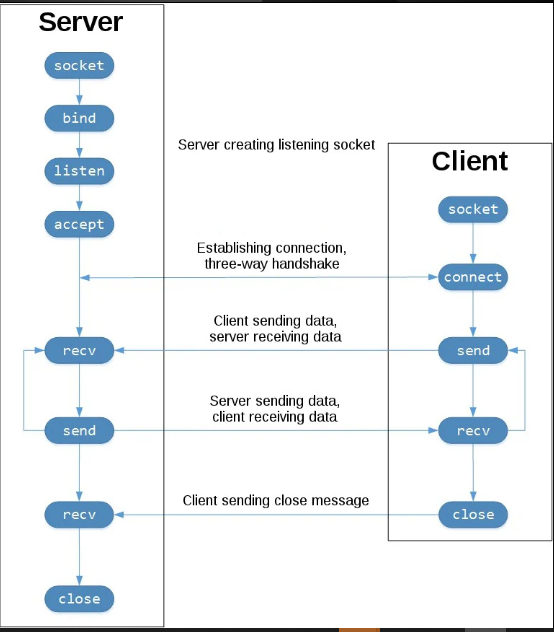

# Wireless-robot-control

This project is for controlling a differential drive robot wirelessly using an ESP32 board. Click [this link](https://drive.google.com/file/d/1X6eS6V8n_o-cJLHjV87ageG8xKd46kXh/view?usp=sharing) for the demo.

## Hardware Integration and Communication

This section describes required hardware components, their connections, layout architecture, and the communication layer between the controller and the motor driver. This chapter will focus on the working of the controller and motor control. A client-server protocol is also established between the laptop and the controller

### Microcontroller
A microcontroller is a small chip having onboard processor, RAM, IO pins, Memory etc. The microcontrollerrcontrols the system bygexecuting thehcommands written in the code and issuing them to the motorjdriver. Furthermore, it is also responsible for the processing and the calculation required to run the drive. As mentioned in the previous chapter, we will be using ESP 32 as our main controller as it has both Wi-Fi and Bluetooth connectivity to receive and transmit signals. This module is very handy and is widely used in IOT based applications. It combines the functionality of different modules in one and is very easy to program. We can program it using the Arduino Ide and importing the ESP package in it. It also has many GPIO (General Purpose Input-Output) pins, UART support, SPI, I2C etc. Conclusively it is a perfect board for this application.

### Motor Control using Motor Driver
Motor Driver: A motor driver is an electronic circuit which is used to run the motor at desired speed and in the desired direction. Motor drivers come in many varieties, but we are going to use the DC motor driver. It is able to operate the motor in both directions and also it provides a continuous spectrum of intermediate RPM’s between zero and the maximum RPM. It basically works on the principle of Pulse Width Modulation signal being fed to the on-board MOSFETS to drive the motors with different speeds and for direction reversal, it uses an H-bridge. High resolution PWM signals are desirable for smooth control as they allow for moreginterpolations between the zero and maximum RPM range of the motor, thus providing superiorgcontrol with greater accuracy. Furthermore, the motor driver should be carefully chosen according to the current requirements of the motors to be used, it may be possible that motor requires high current but the driver is unable to provide it. 

Here, we are going to use L298N motor driver. It is a dual channel motor driver i.e it allows us to control 2 motors simultaneously thus it is perfect for our application. Also it can handle 3A at 35V. Furthermore, it also has PWM pins to provide intermediate voltages.

### Hardware Integration
Below figure shows the connections between the controller, motor-driver, power supply and the motor. The motor driver has a two terminal blocks mounted at each side for each motor. 

OUT1 and OUT2 denotes the positive and negative terminal of motor 1
OUT3 and OUT4 denotes the positive and negative terminals of motor 2. 
12V: The +12V terminal is the power supply
GND: Ground terminal
+5V: Provides 5V if jumper is removed. If jumper is present, it acts as 5V output.

Jumper: If we supply more than 12V, you should remove the jumper, also if jumper is in place it uses the motor power supply to provide to the onboard chip.

1)	If a HIGH signal is sent to the enable 1 pin, motor 1 is ready to be controlled with the maximum speed.
2)	If adLOW signal is sent to the enable 1 pin, motor 1 turns off.
3)	If a PWM signal is sent to the motor driver, we can control the RPM (Rotations Per Minute) of the motor. The motor speed is directly proportional to the duty cycle. But, if a signal lower than a threshold is sent the motors might make a continuous buzzing sound.

The DC motor requires a bigqjump in current to move, so the motorslshould be powered using an external power source from the ESP32. We are using a 12V/ 10A SMPS (Switch mode Power Supply) to power the motors. The switchwbetween the battery holder and the motorqdriver is optional, but it is very handy to cut and apply power. This way you don’t need to constantly connect and thenfdisconnect the wiring to save power. Also a 0.1uF ceramicdcapacitor is soldered to the positive and negativeeterminals of the DC motor, as shown in the diagramlto help smoothmout any voltagekspikes.

### Socket Server-Client Connection Model
Now, to transmit the velocity values and the angles to the robot we need some sort of connection between the robot and the Pc on which the image will be processed. So, we use a Server- Client Model to transmit the data. In a server-client architecture, when the client computer sends a request for data to theeserver through the internet, the server accepts the requested process and delivers the data packets requested back to the client. Socket is the endpoint of a bi-directional communications channel between the server and the client. Sockets communicate within a process, between processes on the same machine, or between processes on different machines. For any communication with a remote program, we have to connect through a socket port.

In this project, the Pc is the socket server and the ESP32 board is the client and an end to end encrypted connection is setup between them via the mobile hotspot of the Pc. Here, the Client sends the request to the server to send the data and waits till it receives the velocity and angle values from the Pc. The Pc calculates these values by tracking the robot through the overhead camera and applying the motion planning and control algorithms on it.

### How to run the code 
1) Build and upload the *Robot_control_using_Wifi.ino* from **Data_transfer_Client** directory to the ESP32 board(mounted on the robot).
2) Run the *data_transfer to control robot.py* from **Data_transfer_Server** in a python ide on your system.(Required modules : **socket** and **pygame**)

